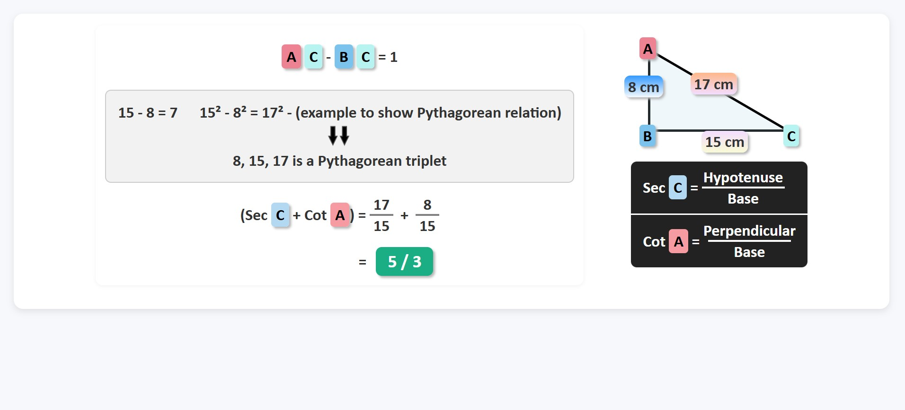
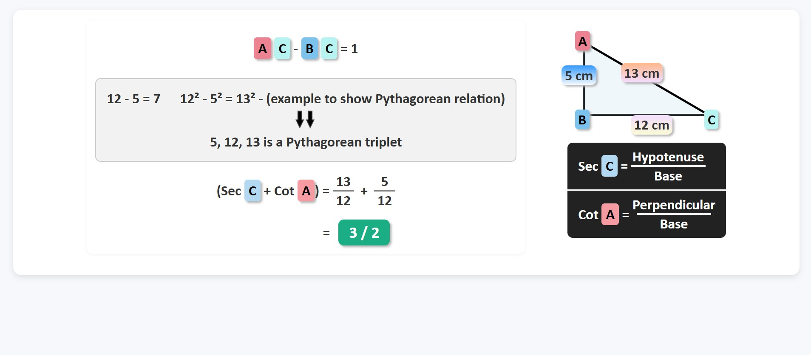
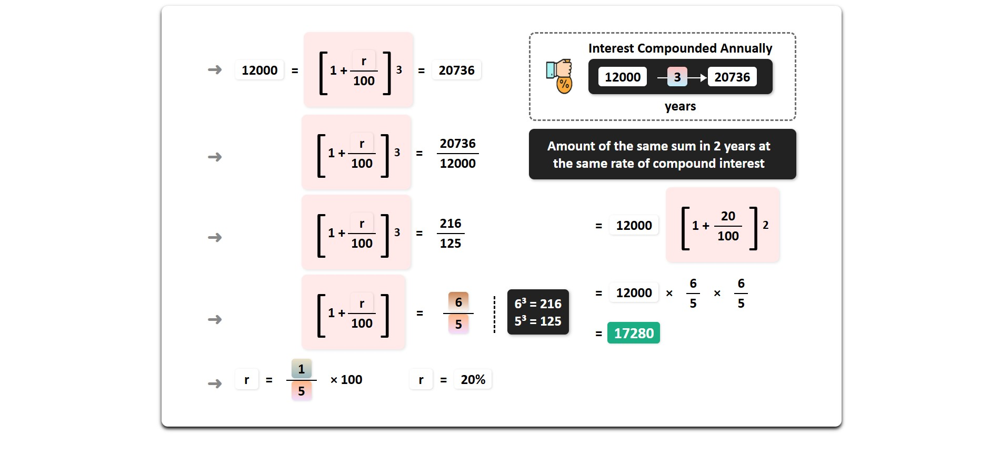

# 🧮 Math Problem Visualization Using Frontend Templates

**By Prasanta Kumar Sahoo — Backend Development Intern**

---

## 🚀 Project Overview

This project demonstrates my ability to translate **mathematical problem-solving** into **interactive, visually structured front-end templates**.  

It was developed as part of an academic assignment to apply **Trigonometry** and **Compound Interest** concepts using **predefined UI templates**, focusing on **logical flow, accuracy, and visual clarity** without altering the original design.

---

## 🎯 Objective

To dynamically represent mathematical calculations through fixed template layouts while maintaining:

- Consistent visual hierarchy  
- Step-by-step logical progression  
- Accurate arithmetic and formula representation  
- Strict adherence to provided front-end design constraints  

---

## 🧩 Project Structure

| Template | Concept | Description |
|----------|---------|-------------|
| **Template 1** | Trigonometry / Pythagorean Triplets | Solves trigonometric ratio problems using step-by-step arithmetic logic with visual guidance. |
| **Template 2** | Compound Interest | Visualizes compound interest growth using percentage and exponential calculations in a structured layout. |

Each template includes **stylized boxes, arrows, and highlights** to guide the logical flow of the solution.

---

## 🧠 Problems & Screenshots

### **Template 1 — Trigonometry / Pythagorean Triplets**

#### Problem 1

**Question:** Find Sec C + Cot A for a triangle with sides \(a = 7, b = 24, c = 25\).  
**Solution Highlights:** Step-by-step calculation using Pythagorean triplet logic.

---

#### Problem 2

**Question:** Find Sec C + Cot A for a triangle with sides \(a = 5, b = 12, c = 13\).  
**Solution Highlights:** Fraction boxes and highlight boxes used to illustrate arithmetic and ratio calculations.

---

### **Template 2 — Compound Interest**

#### Problem 1

**Question:** A principal of ₹12,000 amounts to ₹20,736 in 3 years at compound interest. Find the rate of interest.  
**Solution Highlights:** Step-by-step bracket breakdown, fraction simplification, and final highlighted result.

---

#### Problem 2

**Question:** A principal of ₹5,000 amounts to ₹6,050 in 2 years at compound interest. Find the rate of interest.  
**Solution Highlights:** Step-by-step calculations showing exponential growth and fraction simplification.

---

## ⚙️ Key Features

- Built using **static HTML & CSS templates**  
- Only numbers, variables, and calculation steps were modified — **layout unchanged**  
- Visual logic preserved with **highlight boxes, arrows, and fraction placeholders**  
- Screenshots included for all rendered outputs  
- Demonstrates clean **step-by-step problem-solving** in a UI format  

---

## 🧠 Concepts Implemented

- **Template 1 (Trigonometry):** Pythagorean triplet-based calculations  
  - Example: \( a=8, b=15, c=17 \), Sec C + Cot A calculation  
- **Template 2 (Compound Interest):** Compound interest problems  
  - Example: Principal ₹12,000 → Amount ₹20,736 in 3 years at 20% interest  

---

## 🧾 Deliverables

1. **Template 1:** 2 Trigonometry problems  
2. **Template 2:** 2 Compound Interest problems  
3. Screenshots of all rendered outputs  
4. README documentation for clarity and presentation  

---

## 💡 Learning Outcome

Through this project, I enhanced my skills in:

- Translating **logical math steps into visual UI components**  
- Managing **content placement within strict template constraints**  
- Combining **technical accuracy with visual design consistency**  
- Communicating **complex problem-solving visually** — a key skill for UI/UX-focused development  

---

## 🛠️ Tech Stack

- **Frontend:** HTML, CSS (predefined template-based)  
- **Tools:** VS Code, Git, GitHub  
- **Category:** Educational Visualization / Front-End Logic Representation  

---

## 📈 Project Impact

This project showcases my ability to:

- Implement **mathematical logic in structured UI layouts**  
- Write **clean, maintainable, and visually guided HTML code**  
- Apply **data-driven front-end design for educational purposes**  

It demonstrates both **technical precision** and **design discipline**, qualities that are valuable in professional UI/Frontend roles.

---

## 👨‍💻 Author

**Prasanta Kumar Sahoo**  
Full Stack Developer Intern  
📧 <prasanta6212@example.com>  
🌐 [GitHub Portfolio](https://github.com/prasant-0n)  
💼 [LinkedIn Profile](https://linkedin.com/in/prasanta1/)
